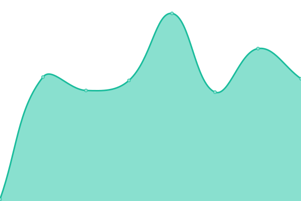

# [📈 Live Status](https://jayantkatia.github.io/site-monitor): <!--live status--> **🟩 All systems operational**

This repository contains the open-source uptime monitor and status page for websites and services used in projects by (jayantkatia)[https://github.com], powered by [Upptime](https://github.com/upptime/upptime).

With [Upptime](https://upptime.js.org), you can get your own unlimited and free uptime monitor and status page, powered entirely by a GitHub repository. We use [Issues](https://github.com/upptime/upptime/issues) as incident reports, [Actions](https://github.com/jayantkatia/exploring-upptime/actions) as uptime monitors, and [Pages](https://upptime.github.io/upptime) for the status page.

<!--start: status pages-->
<!-- This summary is generated by Upptime (https://github.com/upptime/upptime) -->
<!-- Do not edit this manually, your changes will be overwritten -->
<!-- prettier-ignore -->
| URL | Status | History | Response Time | Uptime |
| --- | ------ | ------- | ------------- | ------ |
|  UpMob-API | 🟩 Up | [up-mob-api.yml](https://github.com/jayantkatia/site-monitor/commits/HEAD/history/up-mob-api.yml) | 

 191ms
     
 | 

<a href="https://jayantkatia.github.io/site-monitor/history/up-mob-api">100.00%</a>
    

|  UpMob-API NL | 🟩 Up | [up-mob-api-nl.yml](https://github.com/jayantkatia/site-monitor/commits/HEAD/history/up-mob-api-nl.yml) | 

 1289ms
     
 | 

<a href="https://jayantkatia.github.io/site-monitor/history/up-mob-api-nl">100.00%</a>
    

|  UpMob-API HK | 🟩 Up | [up-mob-api-hk.yml](https://github.com/jayantkatia/site-monitor/commits/HEAD/history/up-mob-api-hk.yml) | 

 3514ms
     
 | 

<a href="https://jayantkatia.github.io/site-monitor/history/up-mob-api-hk">100.00%</a>
    

|  UpMob-API GB | 🟩 Up | [up-mob-api-gb.yml](https://github.com/jayantkatia/site-monitor/commits/HEAD/history/up-mob-api-gb.yml) | 

 1207ms
     
 | 

<a href="https://jayantkatia.github.io/site-monitor/history/up-mob-api-gb">100.00%</a>
    

|  UpMob-API CA | 🟩 Up | [up-mob-api-ca.yml](https://github.com/jayantkatia/site-monitor/commits/HEAD/history/up-mob-api-ca.yml) | 

 1057ms
     
 | 

<a href="https://jayantkatia.github.io/site-monitor/history/up-mob-api-ca">100.00%</a>
    

|  [Google](https://google.com) | 🟩 Up | [google.yml](https://github.com/jayantkatia/site-monitor/commits/HEAD/history/google.yml) | 

 2596ms
     
 | 

<a href="https://jayantkatia.github.io/site-monitor/history/google">100.00%</a>
    

<!--end: status pages-->

[**Visit our status website →**](https://upptime.github.io/upptime)

## 📄 License

- Powered by: [Upptime](https://github.com/upptime/upptime)
- Code: [MIT](./LICENSE) © [Upptime](https://upptime.js.org)
- Data in the `./history` directory: [Open Database License](https://opendatacommons.org/licenses/odbl/1-0/)
